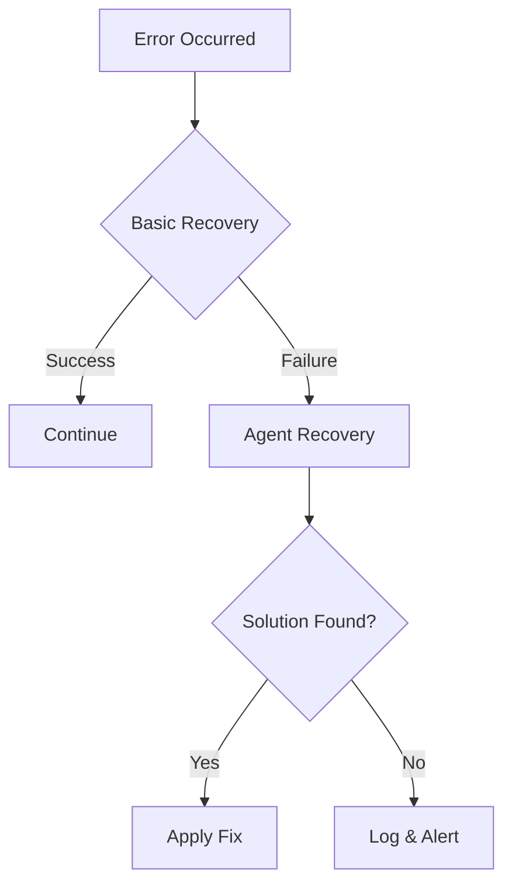

# TapPayGo Developer Documentation

## Table of Contents
1. [Getting Started](#getting-started)
2. [API Reference](#api-reference)
2. [Authentication](#authentication)
3. [Error Handling](#error-handling)
4. [Agent Framework](#agent-framework)
5. [Payment Processing](#payment-processing)
6. [Self-Healing System](#self-healing-system)

## Getting Started
### Prerequisites
- API Key (contact support@tappaygo.com)
- Node.js 16+ or equivalent
- HTTPS-enabled environment

### First API Call
```javascript
// Example: Get payment methods
const response = await fetch('https://api.tappaygo.com/v1/payment-methods', {
  headers: {
    'Authorization': `Bearer YOUR_API_KEY`,
    'Content-Type': 'application/json'
  }
});
const methods = await response.json();
```

### SDKs
Official SDKs available for:
- [JavaScript](https://github.com/tappaygo/js-sdk)
- [Python](https://github.com/tappaygo/python-sdk)
- [Java](https://github.com/tappaygo/java-sdk)

## API Reference
### Base URL
`https://api.tappaygo.com/v1`

### Rate Limits
- 100 requests/minute
- 5000 requests/day

---

## Authentication
### Authentication
#### API Keys
Include in headers:
```http
Authorization: Bearer YOUR_API_KEY
```

#### OAuth2
1. Redirect users to:
`https://auth.tappaygo.com/oauth?client_id=YOUR_CLIENT_ID&redirect_uri=YOUR_REDIRECT_URI`

2. Handle callback with code
3. Exchange code for tokens:
```http
POST /oauth/token
{
  "code": "AUTHORIZATION_CODE",
  "grant_type": "authorization_code"
}
```

### JWT Tokens
- Access Token: Valid for 1 hour
- Refresh Token: Valid for 30 days
- Custom Claims:
  ```json
  {
    "role": "admin|user|agent",
    "permissions": ["payment:create", "user:read"]
  }
  ```

---

## Error Handling
### Error Codes
| Code | Meaning | Recovery Suggestion |
|------|---------|---------------------|
| 4001 | Invalid Payment Token | Refresh token and retry |
| 4010 | Authentication Failed | Reauthenticate user |
| 5032 | Service Unavailable | Implement exponential backoff |

### Self-Healing Flow


---

## Agent Framework
### Core Methods
```typescript
class AgentClient {
  constructor(apiKey: string);
  
  generateWelcomePage(message: string): Promise<GeneratedPage>;
  recordCollaboration(data: CollaborationData): Promise<void>;
  decideRecovery(params: RecoveryParams): Promise<AgentDecision>;
}
```

### Lifecycle Hooks
1. `onInit()` - Agent initialization
2. `onError()` - Error handling
3. `onShutdown()` - Cleanup tasks

---

## Payment Processing
### Payments
#### Create Payment
```http
POST /payments
{
  "amount": 1000,
  "currency": "USD",
  "payment_method": "card",
  "customer": {
    "email": "user@example.com"
  }
}

Response:
{
  "id": "pay_123",
  "status": "requires_action",
  "next_action": {
    "type": "redirect",
    "url": "https://pay.tappaygo.com/confirm/pay_123"
  }
}
```

#### Webhooks
Configure endpoint to receive:
- Payment succeeded
- Payment failed
- Refund processed

### Supported Methods
- Credit/Debit Cards
- Apple/Google Pay
- Bank Transfers
- Crypto Payments

---

## Self-Healing System
### Monitoring Layers
1. **Console Errors** - Automatic capture
2. **Network Requests** - Failed API calls
3. **State Inconsistencies** - Data validation

### Recovery Strategies
| Error Type | Action | Delay |
|------------|--------|-------|
| Network | Retry | 2s |
| Auth | Refresh Token | Immediate |
| Fatal | Reload Page | 5s |

[Back to Top](#table-of-contents)
