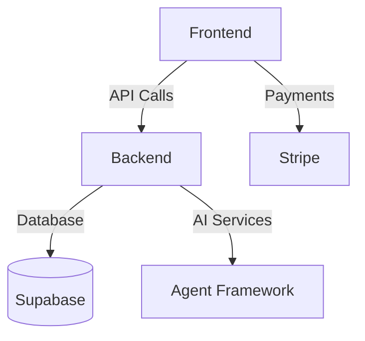

# Aplicație TapToGo - Vizualizare Internă

## Arhitectură Principală

## Componente Cheie MVP
1. **Autentificare**
   - Login/Register
   - Protecție rută
   - Gestionare token

2. **Plăți**
   - Integrare Stripe
   - Scanare carduri
   - Istoric tranzacții

3. **Agent Framework**
   - Auto-healing
   - Generare conținut
   - Monitorizare

4. **Interfață Admin**
   - Dashboard
   - Rapoarte
   - Gestionare utilizatori

## Tehnologii
- **Frontend**: React + TypeScript + Vite
- **Backend**: Supabase Functions
- **AI**: Deepseek + Custom Agents
- **Payments**: Stripe SDK

## Status MVP
✅ Funcționalități de bază  
✅ Integrare plăți  
✅ Sistem auto-healing  
⏳ Optimizări performanță
